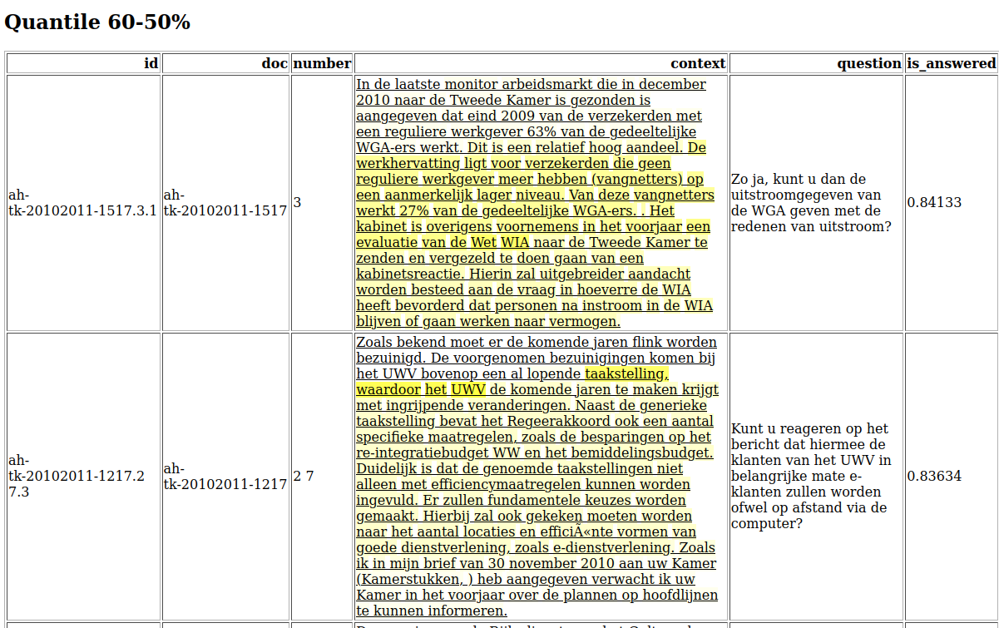

# strample: Stratified sampling for data exploration #

Sometimes you have a `.csv` file containing items (e.g., texts) each with a given numerical value 
(e.g., some kind of probability or score), and you may want to see some random rows. It can be useful
to divide the data into quantiles (based on the numerical value), and then randomly sample some rows per quantile.
That's what this does.

## Install

```bash
pip install pipx
pipx install git+https://github.com/mwestera/strample
```

## Usage

Basic case:

```bash
$ strample some_csv_file.csv
``` 

With more options:

```bash
$ strample some_csv_file.csv --descending --quantiles 30 --key score
```

Actual use case, for the (custom) outputs of a question answering model, `qa_results.jsonl` which contained lines like this:

```json
{"id": "ah-tk-20102011-1778.9 11.3", "doc": "ah-tk-20102011-1778", "number": "9 11", "context": "Naar aanleiding van de aangiften en meldingen hebben het Openbaar Ministerie en de gemeente bezien welke maatregelen mogelijk zijn. Daarbij is ook gekeken naar maatregelen waarbij het Veiligheidshuis een co\u00f6rdinerende rol speelt. Het Veiligheidshuis is een samenwerkingsverband van onder andere het Openbaar Ministerie, de politie, gemeenten, de Raad voor de Kinderbescherming, de Reclassering en de GGD. Het Veiligheidshuis zet persoonsgerichte trajecten op voor overlastgevers en criminelen. Het Veiligheidshuis Frysl\u00e2n is sinds mei 2010 betrokken bij de problematiek in Hemelum. Sindsdien zijn gesprekken met de betrokken families en andere partijen georganiseerd. Dat heeft bijgedragen tot een zekere de\u00ebscalatie, maar heeft de problemen niet kunnen oplossen. De betrokkenheid van het Veiligheidshuis is inmiddels afgerond.", "question": "Wat is de bemoeienis van het Veiligheidshuis Frysl\u00e2n bij de verwikkelingen in Hemelum?", "is_answered": 0.49839, "score": 0.20158, "start": 0, "end": 0, "answer": "", "token_scores": [0.00021, 0.00026, 0.00027, 0.00069, 0.00551, 0.00551, 0.00576, 0.00601, 0.01264, 0.01341, 0.01345, 0.01333, 0.01338, 0.01353, 0.01361, 0.01364, 0.01392, 0.01393, 0.01394, 0.01398, 0.01429, 0.01449, 0.01457, 0.01469, 0.01471, 0.01607, 0.01606, 0.01641, 0.01648, 0.0177, 0.01934, 0.01936, 0.01933, 0.01942, 0.04557, 0.046, 0.04607, 0.04811, 0.04903, 0.04898, 0.04924, 0.04924, 0.05558, 0.05788, 0.05794, 0.05726, 0.05751, 0.05772, 0.05764, 0.05777, 0.05768, 0.05791, 0.058, 0.05801, 0.05802, 0.05806, 0.05802, 0.05809, 0.05816, 0.05815, 0.05819, 0.05894, 0.05816, 0.08491, 0.0851, 0.08552, 0.08645, 0.08671, 0.08657, 0.08657, 0.08701, 0.08699, 0.08718, 0.0873, 0.13142, 0.13201, 0.13275, 0.135, 0.1401, 0.14098, 0.14275, 0.14387, 0.14329, 0.14386, 0.14459, 0.14409, 0.14448, 0.13935, 0.30381, 0.30537, 0.33715, 0.32878, 0.33639, 0.37101, 0.37705, 0.33644, 0.33649, 0.33678, 0.16405, 0.0984, 0.08388, 0.08518, 0.0855, 0.08549, 0.08599, 0.08669, 0.08685, 0.07963, 0.08052, 0.09507, 0.0946, 0.09467, 0.09499, 0.09436, 0.09431, 0.06273, 0.05359, 0.05697, 0.05359, 0.05359, 0.05362, 0.05217, 0.05241, 0.05243, 0.04292], "token_spans": [[0, 4], [5, 15], [16, 19], [20, 22], [23, 32], [33, 35], [36, 45], [46, 52], [53, 56], [57, 65], [66, 76], [77, 79], [80, 82], [83, 91], [92, 98], [99, 104], [105, 116], [117, 125], [126, 130], [130, 131], [132, 139], [140, 142], [143, 146], [147, 154], [155, 159], [160, 171], [172, 179], [180, 183], [184, 199], [200, 203], [204, 217], [218, 221], [222, 228], [228, 229], [230, 233], [234, 249], [250, 252], [253, 256], [257, 277], [278, 281], [282, 287], [288, 294], [295, 298], [299, 307], [308, 318], [318, 319], [320, 322], [323, 330], [330, 331], [332, 341], [341, 342], [343, 345], [346, 350], [351, 355], [356, 358], [359, 376], [376, 377], [378, 380], [381, 393], [394, 396], [397, 399], [400, 403], [403, 404], [405, 408], [409, 424], [425, 428], [429, 445], [446, 455], [456, 458], [459, 463], [464, 478], [479, 481], [482, 492], [492, 493], [494, 497], [498, 513], [514, 521], [522, 524], [525, 530], [531, 534], [535, 539], [540, 549], [550, 553], [554, 556], [557, 569], [570, 572], [573, 580], [580, 581], [582, 591], [592, 596], [597, 607], [608, 611], [612, 614], [615, 624], [625, 633], [634, 636], [637, 643], [644, 652], [653, 666], [666, 667], [668, 671], [672, 677], [678, 689], [690, 693], [694, 697], [698, 704], [705, 716], [716, 717], [718, 722], [723, 728], [729, 731], [732, 741], [742, 746], [747, 753], [754, 762], [762, 763], [764, 766], [767, 780], [781, 784], [785, 788], [789, 804], [805, 807], [808, 817], [818, 826], [826, 827]]}
```

the following command:

```bash
strample qa_results.jsonl --key is_answered --descending --span context,start,end --tokens context,token_scores,token_spans
```

creates a html file looking like this:




For the various options (sort key, sample size, number of quantiles, ascending vs. descending, highlighting spans and tokens) see the help.